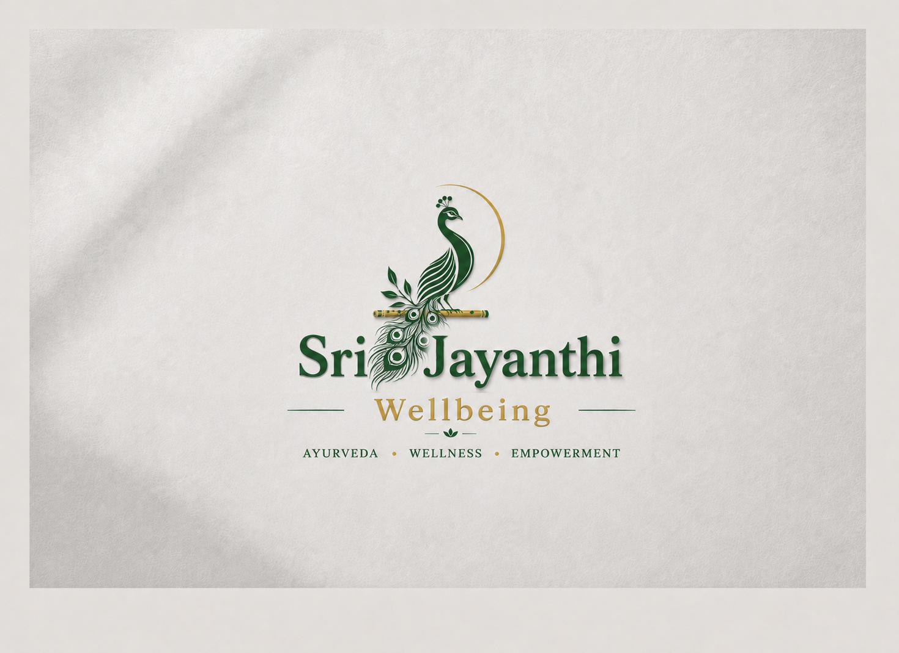

# Sri Jayanthi Wellbeing

<p align="center">
  
</p>

<p align="center">
  <strong>Ayurveda • Wellness • Empowerment</strong>
</p>

<p align="center">
  <a href="https://wa.me/919177816622" target="_blank">
    
  </a>
  <a href="#">
    
  </a>
  <a href="#">
    
  </a>
</p>

---

## About

**Sri Jayanthi Wellbeing** is a Next.js website for an authentic Ayurvedic wellness clinic based in India. The site features a clean, professional white design with subtle handcrafted paper-card aesthetics — built to feel trustworthy, grounded, and modern.

Founded in 2009, Sri Jayanthi specializes in **Panchakarma**, **spine and skin treatments**, and **community medical camps**. The website reflects the clinic's core belief: *"We don't just treat — we teach you to heal."*

---

## Features

- **Six fully responsive pages**: Home, Services, Products, Experience, About, and Reviews
- **Clean white professional design** with light gray accents and gold/forest brand colors
- **WhatsApp integration** for direct consultation booking and product enquiries
- **Animated walking peacock** SVG component for visual attraction
- **Handcrafted card aesthetics** with subtle shadows and clean borders
- **Mobile-first responsive** layout optimized for phones, tablets, and desktops
- **Static site export** for easy deployment to any hosting provider
- **Accessibility-focused** with semantic HTML, proper contrast, and touch-friendly targets

---

## Tech Stack

| Layer | Technology |
|-------|------------|
| Framework | [Next.js 14](https://nextjs.org/) (App Router) |
| Language | [TypeScript](https://www.typescriptlang.org/) |
| Styling | [Tailwind CSS 3](https://tailwindcss.com/) |
| UI Icons | [Lucide React](https://lucide.dev/) |
| Fonts | [Outfit](https://fonts.google.com/specimen/Outfit) (headings), [DM Sans](https://fonts.google.com/specimen/DM+Sans) (body) |

---

## Project Structure

```
├── app/                          # Next.js App Router pages
│   ├── page.tsx                  # Home page
│   ├── layout.tsx                # Root layout with metadata & global nav
│   ├── globals.css               # Global styles, brand colors, custom utilities
│   ├── services/page.tsx         # Services & treatment details
│   ├── products/page.tsx         # Ayurvedic product catalogue
│   ├── experience/page.tsx       # Patient transformations & stats
│   ├── about/page.tsx            # Doctor profile, mission & team
│   └── reviews/page.tsx          # Patient testimonials
├── components/
│   ├── Header.tsx                # Sticky navigation with mobile hamburger
│   ├── Footer.tsx                # Site footer with links & contact
│   ├── WhatsAppButton.tsx        # Floating WhatsApp CTA
│   └── PeacockWalk.tsx           # Animated walking peacock SVG
├── public/
│   └── Logo-Final-Version.png    # Brand logo
├── next.config.js                # Static export configuration
├── tailwind.config.ts            # Custom colors & font families
├── tsconfig.json                 # TypeScript paths & settings
└── package.json                  # Dependencies
```

---

## Brand Identity

| Token | Hex | Usage |
|-------|-----|-------|
| **Forest** | `#1a4a2e` | Primary headings, buttons, footer background |
| **Gold** | `#b8952a` | Accent color, CTAs, stats, section dividers |
| **Cream** | `#ffffff` | Page background |
| **Parchment** | `#f5f5f5` | Alternate section backgrounds |
| **Ink** | `#2c2c2c` | Body text |

---

## Getting Started

### Prerequisites

- [Node.js](https://nodejs.org/) 18+ and npm

### Installation

```bash
# Clone the repository
git clone https://github.com/varunkumar06011/sri-jayanthi.git
cd sri-jayanthi

# Install dependencies
npm install

# Build for static export
npm run build

# Serve locally (optional)
npx serve dist -l 3000
```

Open [http://localhost:3000](http://localhost:3000) in your browser.

---

## Deployment

This project is configured for **static site generation** (`output: 'export'` in `next.config.js`). Deploy the `dist/` folder to:

- [Netlify](https://www.netlify.com/)
- [Vercel](https://vercel.com/)
- [GitHub Pages](https://pages.github.com/)
- Any traditional web host (Apache, Nginx, etc.)

### Netlify Drop (Quickest)

1. Drag and drop the `dist/` folder onto [Netlify Drop](https://app.netlify.com/drop)
2. Your site is live instantly

---

## Customization

### Update contact details

Edit these files to replace placeholders with real information:

- **`components/Footer.tsx`** — clinic address, phone, email
- **`components/WhatsAppButton.tsx`** — WhatsApp number
- **`components/Header.tsx`** — CTA link

### Replace logo

Swap `public/Logo-Final-Version.png` with your own logo file. Update `alt` text in `Header.tsx` and `Footer.tsx`.

### Update content

All page copy is in the `app/` directory — each page is self-contained and easy to edit.

---

## License

This project is proprietary to **Sri Jayanthi Wellbeing**. All rights reserved.

---

<p align="center">
  <em>Ancient healing for modern lives.</em>
</p>
